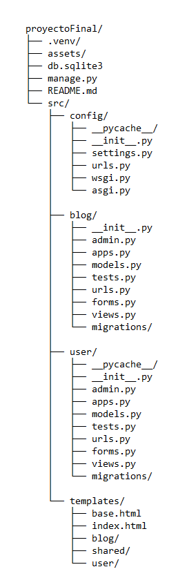
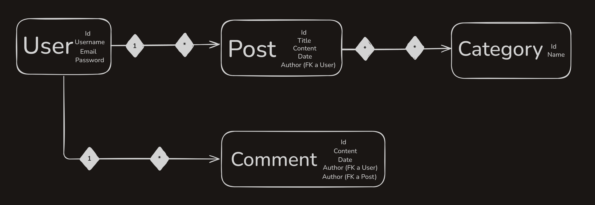

# 📝 Blog Proyecto Final - Django

Este es un blog desarrollado con Django como primera parte de un proyecto final del curso de programación con Python. Permite a los usuarios registrarse, iniciar sesión, crear categorías y posts, comentar y buscar contenido por palabra clave o categoría.


## 🚀 Funcionalidades principales

- Registro e inicio de sesión de usuarios.
- Creación de categorías personalizadas.
- Creación y visualización de posts.
- Comentarios autenticados en cada post.
- Búsqueda por palabra clave o nombre de categoría.
- Expiración de sesión tras 1 hora de inactividad.


## 🧱 Estructura del proyecto




## 🗃️ Diagrama de la base de datos




## ⚙️ Instalación

1. Clona el repositorio:

   ```bash
   git clone https://github.com/ClaudiaRolack/blog-proyectoFinal-django.git
   cd blog-proyectoFinal-django/proyectoFinal

2. Crea un entonor virtual e instala las dependencias:

   ```bash
   python -m venv env
   .venv\Scripts\Activate.ps1 
   pip install -r requirements.txt

3. Aplica las migraciones y crea un superusuario:

   ```bash
   python manage.py migrate
   python manage.py createsuperuser

4. Ejecuta el servidor:

   ```bash
   python manage.py runserver

5. Abre tu navegador en http://127.0.0.1:8000/


## 🧪 Cómo usar la app

1. **Registrate** desde la página principal.
2. **Inicia sesión** con tus credenciales.
3. **Crea una categoría** en la sección correspondiente.
4. **Escribe un post**, eligiendo una o varias categorías.
5. **Explora tus posts** en "Mis posts".
6. **Haz clic en un título** para ver el detalle del post y comentar.
7. **Busca contenido** desde el input de búsqueda (por palabra clave o nombre de categoría).


## 🔐 Seguridad y configuración

- Las sesiones expiran tras 1 hora de inactividad: configurado con SESSION_COOKIE_AGE = 3600 en settings.py.
- Los formularios están protegidos contra ataques CSRF.
- Solo los usuarios autenticados pueden crear contenido o comentar.


## ✅ Requisitos

- Python 3.9+
- Django 5.x
- SQLite (base de datos por defecto)


---


# 💡 ¡Gracias por visitar el proyecto!